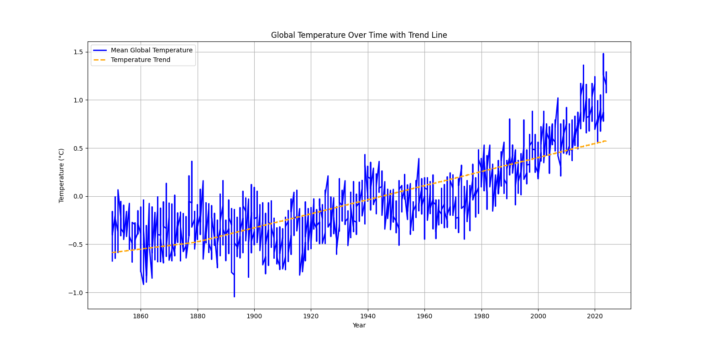
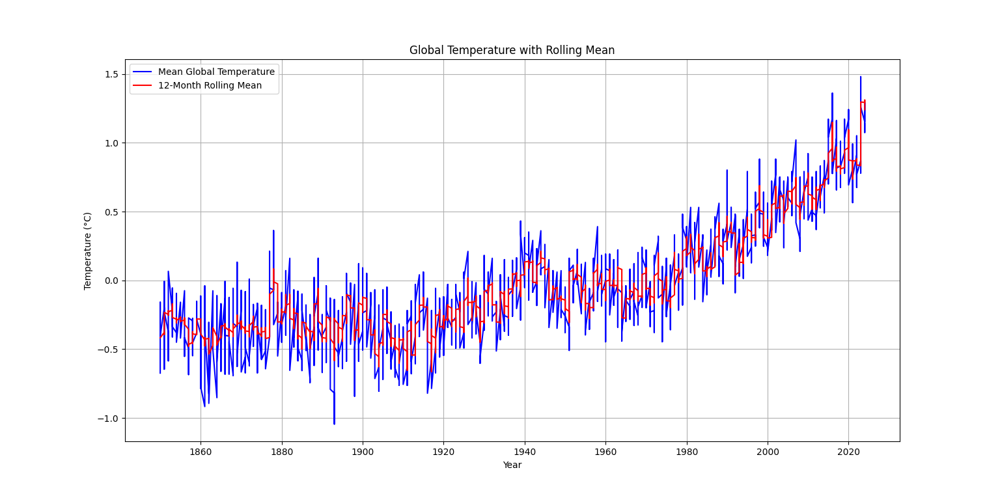

# Global-Temperature-Analysis

This project analyzes global temperature data over time using Python. It visualizes the mean global temperature, calculates a 12-month rolling average, and analyzes the trend using linear regression.

## Features
- Data loading and validation
- Time-series visualization of mean global temperature
- 12-month rolling average calculation and visualization
- Trend analysis using linear regression

## Libraries Used
- `pandas`
- `matplotlib`
- `numpy`
- `sklearn`

## How to Run
1. Clone the repository:
   ```bash
   git clone https://github.com/your-username/Global-Temperature-Analysis.git
   cd Global-Temperature-Analysis

2.Install required libraries:
pip install pandas matplotlib numpy scikit-learn

3.Run the script:
python temperature_analysis.py


## Output
- **Global Temperature Over Time with Trend Line**
   

- **Global Temperature with 12-Month Rolling Mean**
   

The dataset used is from the Global Temperature Data.

Changes from Previous Version
Added linear regression for trend analysis.
Calculated and displayed the change in mean temperature.
Improved visualization with grid lines and enhanced formatting


