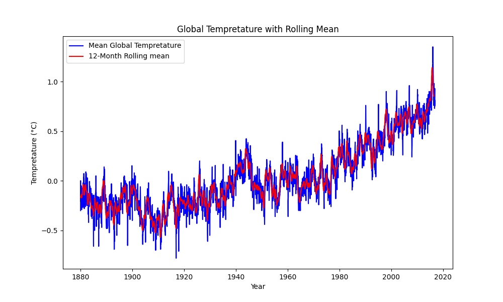

# Global-Temperature-Analysis
This project analyzes global temperature data over time using Python. It visualizes the mean global temperature and calculates a 12-month rolling average for better trend visualization.

## Features
- Data loading and validation
- Time-series visualization of mean global temperature
- 12-month rolling average calculation and visualization

## Libraries Used
- `pandas`
- `matplotlib`

## How to Run
1. Clone the repository:
   ```bash
   git clone https://github.com/your-username/Global-Temperature-Analysis.git
   cd Global-Temperature-Analysis
2. Install required libraries:
pip install pandas matplotlib

3. Run the script:
python temperature_analysis.py

Output:
## Global Temperature Over Time


## Global Temperature with 12-Month Rolling Mean


Dataset
The dataset used is from the Global Temperature Data.


